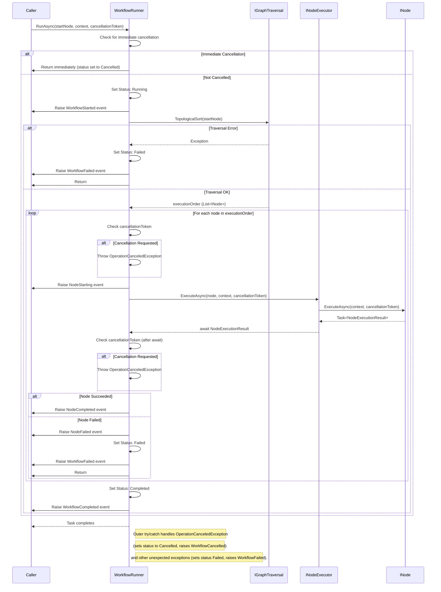

# Nodify Workflow API Documentation

## Getting Started

### Installation

```bash
dotnet add package Nodify.Workflow
```

### Basic Usage

```csharp
using Nodify.Workflow.Core.Graph.Models;
using Nodify.Workflow.Core.Graph.Services;

// Create nodes
var startNode = new Node();
var endNode = new Node();

// Create and connect connectors
var output = new Connector(startNode, ConnectorDirection.Output, typeof(string));
var input = new Connector(endNode, ConnectorDirection.Input, typeof(string));

startNode.AddOutputConnector(output);
endNode.AddInputConnector(input);

// Create connection
var connection = new Connection(output, input);
```

## Core Components

### Node

The basic building block of the workflow graph.

```csharp
public interface INode
{
    Guid Id { get; }
    IReadOnlyCollection<IConnector> InputConnectors { get; }
    IReadOnlyCollection<IConnector> OutputConnectors { get; }
    double X { get; set; }
    double Y { get; set; }
    
    void AddInputConnector(IConnector connector);
    void AddOutputConnector(IConnector connector);
    bool RemoveConnector(IConnector connector);
    bool Validate();
}
```

#### Example: Creating a Custom Node

```csharp
public class StringProcessorNode : Node
{
    public StringProcessorNode()
    {
        // Create input connector
        var input = new Connector(this, ConnectorDirection.Input, typeof(string));
        AddInputConnector(input);

        // Create output connector
        var output = new Connector(this, ConnectorDirection.Output, typeof(string));
        AddOutputConnector(output);
    }

    public override bool Validate()
    {
        // Custom validation logic
        return base.Validate() && 
               InputConnectors.Count == 1 && 
               OutputConnectors.Count == 1;
    }
}
```

### Connector

Represents a connection point on a node.

```csharp
public interface IConnector
{
    Guid Id { get; }
    ConnectorDirection Direction { get; }
    INode ParentNode { get; }
    Type DataType { get; }
    IReadOnlyCollection<IConnection> Connections { get; }
    
    bool AddConnection(IConnection connection);
    bool RemoveConnection(IConnection connection);
    bool ValidateConnection(IConnector other);
}
```

#### Example: Type-Safe Connections

```csharp
// Create strongly-typed connectors
var numberOutput = new Connector(node1, ConnectorDirection.Output, typeof(int));
var stringInput = new Connector(node2, ConnectorDirection.Input, typeof(string));

// This will fail validation due to type mismatch
var connection = new Connection(numberOutput, stringInput); // Throws ArgumentException
```

### Connection

Links two connectors together.

```csharp
public interface IConnection
{
    Guid Id { get; }
    IConnector Source { get; }
    IConnector Target { get; }
    
    bool Validate();
    void Remove();
}
```

#### Example: Managing Connections

```csharp
// Use Graph class to manage connections and check for cycles
var graph = new Graph();
graph.AddNode(node1);
graph.AddNode(node2);

var addResult = graph.TryAddConnection(output, input);

if (addResult.Success)
{
    var connection = addResult.Result;
    Console.WriteLine($"Connection {connection.Id} added.");

    // Check validity (basic check on connection itself)
    if (!connection.Validate())
    {
        // Handle invalid connection state (e.g., source/target became null)
    }

    // Remove connection using graph
    graph.RemoveConnection(connection);
}
else
{
    // Handle connection failure (e.g., cycle detected, invalid types, node not found)
    Console.WriteLine($"Failed to add connection: {addResult.ErrorMessage}");
}
```

### 3. Validation

```csharp
// GOOD: Use Graph methods for connection creation and validation
var graph = new Graph();
graph.AddNode(node1);
graph.AddNode(node2);
var addResult = graph.TryAddConnection(output, input);

if (!addResult.Success)
{
    // Handle errors (type mismatch, cycle detected, etc.)
    Console.WriteLine($"Validation/Connection failed: {addResult.ErrorMessage}");
}

// GOOD: Use Graph validation for overall integrity
var validationResult = graph.TryValidate();
if (!validationResult.Success)
{
     Console.WriteLine($"Graph validation failed: {validationResult.ErrorMessage}");
}
```

## Graph Traversal

The `GraphTraversal` service provides methods to explore and analyze the workflow graph.

### Depth-First Traversal

```csharp
var traversal = new GraphTraversal();

// Visit all nodes
traversal.DepthFirstTraversal(startNode, node => {
    Console.WriteLine($"Visiting node: {node.Id}");
    return true; // continue traversal
});

// Stop at specific condition
traversal.DepthFirstTraversal(startNode, node => {
    if (node.OutputConnectors.Count == 0) {
        Console.WriteLine("Found end node!");
        return false; // stop traversal
    }
    return true;
});
```

### Finding Paths

```csharp
// Find shortest path between nodes (by edge count)
var shortestPath = traversal.FindShortestPath(startNode, endNode);
if (shortestPath.Count > 0)
{
    Console.WriteLine("Shortest path found:");
    foreach (var node in shortestPath)
    {
        Console.WriteLine($"-> {node.Id}");
    }
}

// Find ALL simple paths between nodes (no repeated nodes in a path)
var allPaths = traversal.FindAllSimplePaths(startNode, endNode);
Console.WriteLine($"Found {allPaths.Count()} simple paths:");
foreach (var path in allPaths)
{
    Console.WriteLine("Path:");
    foreach (var node in path)
    {
        Console.WriteLine($"  -> {node.Id}");
    }
}

// Find node by ID
var targetId = Guid.Parse("...");
var foundNode = traversal.FindNodeById(startNode, targetId);
```

### Analyzing Graph Structure

```csharp
// Get entry points (nodes with no inputs)
var entryPoints = traversal.GetEntryPoints(startNode);

// Get exit points (nodes with no outputs)
var exitPoints = traversal.GetExitPoints(startNode);

// Get execution order
var sortedNodes = traversal.TopologicalSort(startNode);
```

## Best Practices

### 1. Connection Management

```csharp
// GOOD: Let the Connection constructor handle bidirectional relationships
var connection = new Connection(output, input);

// BAD: Don't manually manage connections
output.AddConnection(connection);
input.AddConnection(connection);
```

### 2. Resource Cleanup

```csharp
// GOOD: Use the Remove method to clean up connections
connection.Remove();

// BAD: Don't manually remove from just one side
connector.RemoveConnection(connection);
```

### 3. Validation

```csharp
// GOOD: Use Graph methods for connection creation and validation
var graph = new Graph();
graph.AddNode(node1);
graph.AddNode(node2);
var addResult = graph.TryAddConnection(output, input);

if (!addResult.Success)
{
    // Handle errors (type mismatch, cycle detected, etc.)
    Console.WriteLine($"Validation/Connection failed: {addResult.ErrorMessage}");
}

// GOOD: Use Graph validation for overall integrity
var validationResult = graph.TryValidate();
if (!validationResult.Success)
{
     Console.WriteLine($"Graph validation failed: {validationResult.ErrorMessage}");
}
```

### 4. Type Safety

```csharp
// GOOD: Use strongly-typed connectors
var stringOutput = new Connector(node, ConnectorDirection.Output, typeof(string));

// BAD: Don't use object type unless absolutely necessary
var genericOutput = new Connector(node, ConnectorDirection.Output, typeof(object));
```

## Error Handling

Common exceptions and how to handle them:

```csharp
try
{
    var connection = new Connection(output, input);
}
catch (ArgumentException ex)
{
    // Handle invalid connection parameters
    // - Incompatible types
    // - Wrong connector directions
    // - Invalid connection state
}
catch (InvalidOperationException ex)
{
    // Handle operation failures
    // - Circular reference detection
    // - Connection limit exceeded
}
```

## Workflow Execution

This section describes the components responsible for executing a defined workflow graph.

### Execution Context (`IExecutionContext`, `ExecutionContext`)

Manages the state for a single workflow run.

```csharp
public interface IExecutionContext
{
    Guid ExecutionId { get; }
    ExecutionStatus CurrentStatus { get; }
    Guid? CurrentNodeId { get; }
    
    void SetVariable(string key, object? value);
    object? GetVariable(string key);
    bool TryGetVariable<T>(string key, out T? value);
    IReadOnlyDictionary<string, object?> GetAllVariables();

    void SetStatus(ExecutionStatus status);
    void AddLog(string message);
    IEnumerable<string> GetLogs();
    void SetCurrentNode(Guid nodeId);
    void ClearCurrentNode();
    bool EvaluateCondition(string condition); // Basic condition evaluation
}

// Concrete implementation
public class ExecutionContext : IExecutionContext { /* ... */ }
```

**Key Features:**
- **State Management**: Stores variables using case-insensitive keys.
- **Status Tracking**: Tracks the workflow's current state (`NotStarted`, `Running`, `Completed`, `Failed`, `Cancelled`).
- **Logging**: Collects simple string-based logs during execution.

#### Example: Using ExecutionContext

```csharp
// Create a new context for a workflow run
var context = new ExecutionContext();

// Set initial variables
context.SetVariable("InputData", "some_value");
context.SetVariable("Threshold", 100);

// Inside a node's ExecuteAsync method:
public override async Task<NodeExecutionResult> ExecuteAsync(IExecutionContext context, CancellationToken ct)
{
    if (context.TryGetVariable<int>("Threshold", out var threshold))
    {
        if (threshold > 50)
        {
            context.AddLog($"Threshold {threshold} met.");
            // ... process ...
            context.SetVariable("ProcessedValue", 123);
            return NodeExecutionResult.Succeeded();
        }
    }
    context.AddLog("Threshold not met or not found.");
    return NodeExecutionResult.Failed(new InvalidOperationException("Threshold condition not met."));
}
```

### Workflow Runner (`WorkflowRunner`)

Orchestrates the execution of the workflow graph.

```csharp
public class WorkflowRunner
{
    // Constructor requires traversal logic and node execution logic
    public WorkflowRunner(IGraphTraversal traversal, INodeExecutor nodeExecutor);

    // Events (see below)
    public event EventHandler<WorkflowExecutionStartedEventArgs>? WorkflowStarted;
    public event EventHandler<NodeExecutionStartingEventArgs>? NodeStarting;
    // ... other events ...
    public event EventHandler<WorkflowCancelledEventArgs>? WorkflowCancelled;

    // Method to start execution
    public virtual async Task RunAsync(
        INode startNode, 
        IExecutionContext context, 
        CancellationToken cancellationToken = default);
}
```

**Execution Flow Diagram:**



### Execution Events

The `WorkflowRunner` provides events to monitor the execution progress.

- **`WorkflowStarted`**: `EventHandler<WorkflowExecutionStartedEventArgs>`
  - Raised once when `RunAsync` begins processing (after initial cancellation check).
  - `WorkflowExecutionStartedEventArgs` contains `IExecutionContext` and `WorkflowId` (Guid).
- **`NodeStarting`**: `EventHandler<NodeExecutionStartingEventArgs>`
  - Raised just before `INodeExecutor.ExecuteAsync` is called for a node.
  - `NodeExecutionStartingEventArgs` inherits from `NodeExecutionEventArgs` (contains `INode`, `IExecutionContext`).
- **`NodeCompleted`**: `EventHandler<NodeExecutionCompletedEventArgs>`
  - Raised after a node executes successfully.
  - `NodeExecutionCompletedEventArgs` inherits from `NodeExecutionEventArgs`.
- **`NodeFailed`**: `EventHandler<NodeExecutionFailedEventArgs>`
  - Raised when a node fails execution (returns failed result or throws non-cancellation exception).
  - `NodeExecutionFailedEventArgs` contains `INode`, `IExecutionContext`, and the `Exception Error`.
- **`WorkflowCancelled`**: `EventHandler<WorkflowCancelledEventArgs>`
  - Raised when execution is stopped due to cancellation request.
  - `WorkflowCancelledEventArgs` contains the `IExecutionContext`.
- **`WorkflowCompleted`**: `EventHandler<WorkflowExecutionCompletedEventArgs>`
  - Raised when the entire workflow executes successfully.
  - `WorkflowExecutionCompletedEventArgs` contains `IExecutionContext` and the final `ExecutionStatus` (Completed).
- **`WorkflowFailed`**: `EventHandler<WorkflowExecutionFailedEventArgs>`
  - Raised when the workflow stops due to a node failure or an unexpected runner exception.
  - `WorkflowExecutionFailedEventArgs` contains `IExecutionContext`, the `Exception Error`, and the `INode? FailedNode` (if applicable).

#### Example: Subscribing to Events

```csharp
var traversal = new DefaultGraphTraversal();
var executor = new DefaultNodeExecutor();
var runner = new WorkflowRunner(traversal, executor);
var context = new ExecutionContext();

runner.WorkflowStarted += (sender, args) => Console.WriteLine($"Workflow {args.WorkflowId} started.");
runner.NodeStarting += (sender, args) => Console.WriteLine($"Node {args.Node.Id} starting.");
runner.NodeCompleted += (sender, args) => Console.WriteLine($"Node {args.Node.Id} completed.");
runner.NodeFailed += (sender, args) => Console.WriteLine($"Node {args.Node.Id} failed: {args.Error.Message}");
runner.WorkflowCompleted += (sender, args) => Console.WriteLine($"Workflow completed with status: {args.FinalStatus}");
runner.WorkflowFailed += (sender, args) => Console.WriteLine($"Workflow failed: {args.Error.Message}");
runner.WorkflowCancelled += (sender, args) => Console.WriteLine("Workflow cancelled.");

// Assume startNode is defined
await runner.RunAsync(startNode, context);
```

### Cancellation

Workflow execution can be cancelled using a `CancellationToken`.

- Pass a `CancellationToken` to `WorkflowRunner.RunAsync`.
- The token is propagated to the `INodeExecutor` and `INode`.
- Nodes performing long operations should check the token (`cancellationToken.IsCancellationRequested` or `ThrowIfCancellationRequested()`) or pass it to cancellable async methods (e.g., `Task.Delay(ms, token)`).
- The `WorkflowRunner` checks for cancellation before executing each node and catches `OperationCanceledException` to trigger the cancellation flow.

#### Example: Running with Cancellation

```csharp
var runner = new WorkflowRunner(...);
var context = new ExecutionContext();
var startNode = ...; // Your starting node

var cts = new CancellationTokenSource();

// Start the workflow in the background
Task workflowTask = runner.RunAsync(startNode, context, cts.Token);

// Simulate waiting for some condition or user input
await Task.Delay(1000);

// Decide to cancel
Console.WriteLine("Requesting cancellation...");
cts.Cancel();

try
{
    // Await the task to observe the cancellation or completion
    await workflowTask;
    Console.WriteLine($"Workflow finished with status: {context.CurrentStatus}");
}
catch (Exception ex) // Catch any unexpected exceptions from RunAsync itself
{
    Console.WriteLine($"Unexpected error during workflow execution: {ex.Message}");
}
```

## Advanced Usage

### Custom Validation Rules

```csharp
public class CustomConnector : Connector
{
    public override bool ValidateConnection(IConnector other)
    {
        // Custom validation logic
        if (!base.ValidateConnection(other))
            return false;

        // Additional rules
        if (Connections.Count >= 3)
            return false; // Maximum 3 connections

        return true;
    }
}
```

### Graph Analysis

```csharp
public class GraphAnalyzer
{
    private readonly GraphTraversal _traversal;

    public bool HasCycles(INode startNode)
    {
        var visited = new HashSet<INode>();
        var stack = new HashSet<INode>();
        
        bool DFS(INode node)
        {
            if (stack.Contains(node))
                return true; // Cycle detected
                
            if (visited.Contains(node))
                return false;
                
            visited.Add(node);
            stack.Add(node);
            
            foreach (var connector in node.OutputConnectors)
            foreach (var connection in connector.Connections)
            {
                if (DFS(connection.Target.ParentNode))
                    return true;
            }
            
            stack.Remove(node);
            return false;
        }
        
        return DFS(startNode);
    }
}
```

## Performance Tips

1. **Avoid Unnecessary Traversals**
   ```csharp
   // GOOD: Store references when needed frequently
   var endNodes = traversal.GetExitPoints(startNode).ToList();
   
   // BAD: Don't traverse repeatedly
   foreach (var item in items)
   {
       var ends = traversal.GetExitPoints(startNode);
       // Process ends...
   }
   ```

2. **Use Appropriate Collections**
   ```csharp
   // GOOD: Use HashSet for visited nodes
   var visited = new HashSet<INode>();
   
   // BAD: Don't use List for lookups
   var visited = new List<INode>();
   ```

3. **Optimize Validation**
   ```csharp
   // GOOD: Cache validation results when possible
   private bool? _isValid;
   public override bool Validate()
   {
       if (_isValid.HasValue)
           return _isValid.Value;
           
       _isValid = PerformValidation();
       return _isValid.Value;
   }
   ```
